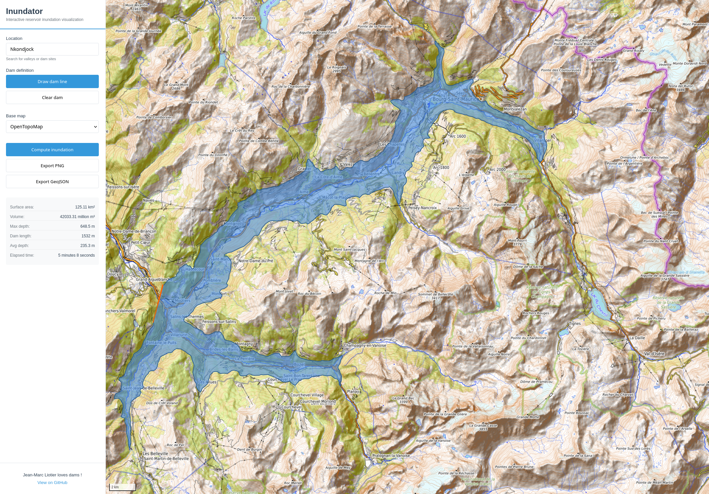

# Inundator

Interactive reservoir inundation simulation visualization tool. Draw a dam on a map and simulate the resulting reservoir using Digital Elevation Model (DEM) data.

The whole Tarentaise valley flooded in five minutes ? Sure !

Try it: https://liotier.github.io/Geogizmos/Inundator/



## Features

- **Interactive Dam Drawing**: Click two points on the map to define a dam line
- **Automatic Crest Elevation**: Calculates optimal dam height from terrain data with 95% fill level safety factor
- **Physics-Based Flooding**: Simulates water accumulation following natural topography
- **Dynamic DEM Expansion**: Automatically expands terrain data for massive valley lakes (up to 100km radius)
- **Real-time Visualization**: See the reservoir extent on the map with semi-transparent water overlay
- **Reservoir Statistics**: Surface area, volume, depth metrics, and dam length
- **Multiple Basemaps**: OpenTopoMap (with contour lines), OpenStreetMap, or satellite imagery
- **Export Options**: Save results as PNG images or GeoJSON files
- **Location Search**: Built-in geocoding to find valleys and dam sites worldwide

## Architecture

The application uses a modular ES6 architecture:

```
Inundator/
├── index.html              # Main HTML page
├── css/
│   └── styles.css          # Application styles
└── js/
    ├── config.js           # Configuration parameters
    ├── app.js              # Main application controller
    ├── core/               # Core functionality modules
    │   ├── elevation-service.js    # DEM tile fetching
    │   ├── dam-geometry.js         # Dam line operations
    │   ├── polygon-generator.js    # Flood polygon creation
    │   └── statistics.js           # Metrics calculation
    ├── ui/                 # User interface modules
    │   ├── map-manager.js          # MapLibre GL map handling
    │   └── visualization.js        # Map layer rendering
    └── workers/
        └── flood-worker.js         # Flood algorithm (Web Worker)
```

## How It Works

### Functional Overview

When you draw a dam line across a valley, Inundator simulates the reservoir that would form behind it:

1. **Dam Crest Calculation**: Analyzes terrain elevation along your dam line and calculates the optimal crest height (95% of maximum elevation for safety margin)
2. **Dam Extension**: Extends the dam line perpendicular to the valley walls at terrain elevations above the crest, preventing water leakage around the sides
3. **Flood Simulation**: Simulates water filling to a level 1 meter below the dam crest (safety freeboard), spreading across all terrain below this elevation
4. **Upstream Selection**: Distinguishes between the confined upstream reservoir (what you want) and the potentially unbounded downstream river (which would run to the ocean)
5. **Polygon Generation**: Converts the flooded grid cells into a smooth polygon using marching squares algorithm
6. **Statistics Calculation**: Computes surface area, volume, maximum depth, and other metrics

The result is a realistic reservoir boundary that follows natural topography.

### Technical Algorithm

The flood algorithm runs in a Web Worker (separate thread) to keep the UI responsive:

**Phase 1: Initialization**

1. **Dam Geometry**:
   - Extends the user-drawn dam line to valley walls (cells above water level)
   - Creates a barrier set representing the dam structure
   - Caches geometry for reuse if DEM expands (same dam endpoints = same geometry)

2. **Seed Finding**:
   - Identifies starting cells adjacent to the middle of the dam
   - Seeds must be below water level (dam crest - 1m safety margin)
   - Finds seeds on both sides of the dam

3. **Partitioning Setup**:
   - Calculates dam vector from first to last endpoint
   - Uses cross product to partition flooded cells into three categories:
     - Left side (cross product > 0)
     - Right side (cross product < 0)
     - On the perpendicular line (cross product = 0, not assigned to either side)
   - This ternary classification enables detection of which side is confined (upstream) vs runaway (downstream)

**Phase 2: Flood Fill**

Uses simple breadth-first search (BFS) with a FIFO queue:

```
visited = array marking cells as: 0=unvisited, 1=flooded, 2=barrier
queue = simple FIFO queue starting with seed cells
leftSide, rightSide = sets tracking flooded cells by dam side
maxWaterLevel = damCrestElevation - 1.0  // Safety freeboard

while queue not empty and iterations < limit:
    cell = queue.shift()

    for each neighbor of cell:
        if neighbor elevation < maxWaterLevel and not visited:
            mark as flooded
            partition into leftSide or rightSide using cross product
            add to queue

    every 50k iterations:
        check if approaching DEM edge → request expansion if needed
        check growth rates → detect stagnation (see below)
        check total area → abort if exceeds 1000 km² safety limit
```

**Phase 3: Stagnation Detection**

Every 50,000 iterations, the algorithm analyzes growth patterns:

- **Confined valley**: One side stops growing (bounded by terrain)
- **Runaway downstream**: Other side keeps growing (river flowing to ocean)
- **Detection criteria**: Side is stagnant if:
  - Not growing at all, OR
  - Other side is growing 10x faster AND is 5x larger
- **Action**: After 3 consecutive stagnant checks (150k iterations), select stagnant side as upstream reservoir

This prevents the algorithm from flooding entire continents when the dam placement accidentally includes downstream drainage.

**Phase 4: Final Selection**

If stagnation doesn't trigger (both sides confined):

- **V-shaped valley detection**: If size ratio < 4x, both sides are legitimate upstream - keep both
- **One-sided valley**: If one side is 4x+ larger, select smaller as upstream, reject larger as downstream

**Phase 5: Polygon Generation**

- Creates binary grid (1 = flooded, 0 = dry)
- Applies D3 marching squares algorithm to generate contour at threshold 0.5
- Converts grid coordinates back to geographic coordinates (lat/lon)
- Returns GeoJSON polygon feature

### DEM Expansion

When flooding approaches the edge of loaded terrain data:

1. **Edge Detection**: Checks if any flooded cells are within 20% of grid boundary
2. **State Preservation**: Serializes queue, flooded cells, stagnation counters, growth tracking
3. **Expansion Request**: Requests 2x larger DEM buffer (10km → 20km → 40km → 80km)
4. **Tile Fetching**: Fetches additional DEM tiles in parallel (up to 8 concurrent requests)
5. **State Restoration**: Remaps all saved cells to new larger grid using coordinate math
6. **Resume**: Continues flood fill from exact point where it left off

The algorithm can expand multiple times, supporting reservoirs up to 100km radius.

### Correctness Guarantees

The algorithm correctly handles:

- **Complex topography**: Islands, peninsulas, multiple arms
- **Natural barriers**: Ridges, hills, saddles within the flood zone
- **V-shaped valleys**: Detects when both sides are legitimate upstream
- **Curved valleys**: Conservative stagnation thresholds prevent premature stopping
- **Massive lakes**: Safety limit (1000 km²) prevents runaway computation
- **Ternary partition edge case**: Cells exactly on perpendicular (cross product = 0) handled correctly
- **Edge cases**: DEM expansion preserves exact state across grid size changes

## Design Decisions

### Why Simple BFS Instead of Priority Queue?

Early versions used a min-heap priority queue (Dijkstra-like algorithm) to flood lowest elevations first. This was replaced with simple breadth-first search (BFS) using a FIFO queue for several reasons:

**Advantages of BFS**:
- **Simpler**: O(1) queue operations vs O(log n) for heap
- **Faster**: No sorting overhead - just add to end, remove from front
- **Sufficient**: With fixed water level, elevation order doesn't matter for correctness
- **Predictable**: Linear growth pattern makes stagnation detection reliable

**Why priority queue wasn't needed**:
- Water level is fixed at (dam crest - 1m), not gradually rising
- All cells below this level will flood regardless of order
- We only care about spatial extent, not filling sequence
- Stagnation detection works on growth rates, not elevation gradients

### Why Fixed Water Level?

The algorithm uses a constant water level (dam crest - 1m) rather than simulating gradual filling:

**Advantages**:
- **Simplicity**: No need to track rising water or time steps
- **Speed**: Flood all reachable cells in one pass
- **Sufficient for planning**: Users want to know maximum extent at full capacity
- **Conservative**: 1m freeboard provides safety margin for wave action

**Limitation**: Cannot simulate intermediate fill levels or filling dynamics. The tool shows maximum capacity only.

### Why Ternary Partition Using Cross Product?

The algorithm uses cross product to partition flooded cells into three categories:

**The three categories**:
1. **Left side**: cross product > 0
2. **Right side**: cross product < 0
3. **On perpendicular line**: cross product = 0 (cells exactly on the line perpendicular to dam, not assigned to either side)

**Purpose**: Distinguish upstream reservoir from downstream river in real-time

**Why cross product**:
- **Works for any dam orientation**: Automatically adjusts to dam angle
- **Real-time classification**: Cells classified as flooded, no post-processing
- **Enables stagnation detection**: Track growth of each side independently
- **Mathematically precise**: Perpendicular line defined by geometry, not heuristics

**Alternatives considered and rejected**:
1. **Connected component analysis after flooding**: Would flood entire river system first, wasting computation
2. **Elevation-based heuristics**: Fails for dams in valleys with gentle downstream slopes
3. **Distance from dam**: Fails for curved valleys where upstream bends back

**Handling the ternary case**: Cells with cross product = 0 (exactly on the perpendicular line) are still flooded but not counted toward left or right growth statistics. In practice, this is rare due to discrete grid.

### Why Stagnation Detection?

Without upstream/downstream detection, the algorithm would flood until hitting ocean (millions of cells):

**Key insight**: In a real valley, upstream reservoir is confined by terrain (stops growing), while downstream river is unbounded (keeps growing to ocean).

**Detection method**:
- Track growth rate of each side every 50k iterations
- Side is "stagnant" if it stops growing OR grows much slower than other side
- After 3 consecutive stagnant checks (150k iterations), select stagnant side as upstream

**Thresholds are conservative** (10x growth difference, 5x size difference) to avoid premature stopping in curved valleys where one arm might temporarily slow down.

### Why V-Shaped Valley Detection?

In some valleys, both sides of the ternary partition are legitimate upstream (valley forks into two arms):

**Detection**: If the size ratio between larger and smaller side < 4x, consider both sides upstream

**Rationale**:
- True downstream runaway would be orders of magnitude larger (10x-100x+)
- 4x threshold allows for realistic asymmetry in valley arms
- Conservative: Better to include both arms than incorrectly reject one
- Ternary classification treats middle cells (cross product = 0) as neither side

**Example**: Dam across valley that splits into two tributary canyons. Both arms should be included in reservoir, even if one is somewhat larger.

**Implementation**: When neither side triggers stagnation detection and both sides are similar in size, combine them: `flooded = new Set([...leftSide, ...rightSide])`

### Why Revert Boundary-Only Polygon Optimization?

An earlier optimization (commit 631e4ca) attempted to process only boundary cells for polygon generation (100x speedup):

**Why it was removed**:
1. **Reliability over performance**: Multiple test failures with "0 boundary cells"
2. **Inherent complexity**: Boundary cells accumulated during flood fill were biased toward recently growing areas
3. **Stagnation conflict**: When stagnation detection selected non-growing side (e.g., left) as upstream, boundary cells from growing side (right) had no overlap
4. **Ternary partition complication**: Middle cells (cross product = 0) made boundary tracking even more complex
5. **Multiple failed fixes**: Three attempts to fix (filtering, recalculation) added complexity without guaranteeing reliability
6. **Maintenance burden**: Future changes to flood algorithm or ternary classification could easily break boundary tracking

**Current approach**: Process all flooded cells for polygon generation using marching squares. Slower but reliable and correct.

**Performance impact**: For typical reservoirs (50k-500k cells), polygon generation completes in 1-3 seconds. The reliability gain justifies the performance cost.

### Why 1000 km² Area Safety Limit?

The algorithm aborts if flooded area exceeds 1000 km²:

**Purpose**: Prevent runaway computation from user error (dam placed in wrong location)

**Examples that would trigger this**:
- Dam placed downstream of valley (floods to ocean)
- Dam placed on major river with flat floodplain
- Very flat terrain where stagnation detection fails

**User experience**: Clear error message explains the limit and suggests solutions:
1. Raise dam crest elevation (reduces flooded area)
2. Place dam in narrower section of valley
3. If genuinely modeling a massive reservoir, increase limit in config.js

**Why 1000 km²**: Generous limit that accommodates very large valley reservoirs while still preventing pathological cases. For reference, Lake Mead is ~640 km² at full capacity.

**Configurable**: Can be adjusted in `config.js` (`maxReservoirAreaKm2`) for specialized use cases

### Why Web Worker Architecture?

Flood computation runs in a separate Web Worker thread:

**Advantages**:
- **Responsive UI**: User can pan/zoom map during computation
- **Non-blocking**: Browser doesn't freeze on million-cell floods
- **Progress updates**: Can show real-time status without blocking UI

**Trade-offs**:
- **Message passing overhead**: Must serialize data to send between threads
- **Debugging complexity**: Worker logs separate from main thread
- **No shared state**: Worker can't directly access DOM or map instance

**Verdict**: Overhead is negligible compared to computation time, and responsive UI is essential for user experience.

## Configuration

All tunable parameters are in `js/config.js`:

- **DEM Settings**: Initial buffer (10km), maximum buffer (100km), zoom levels, tile limits
- **Flood Algorithm**: Iteration limits (20M), seed search radius, water body scoring weights, edge proximity detection
- **Dam Parameters**: Safety factor (95% fill level), sampling intervals
- **Visualization**: Colors, opacity, simplification tolerance
- **Map Settings**: Default location, basemaps, zoom limits

## Usage

### Basic Workflow

1. **Search Location**: Enter a valley or dam site name in the location search box
2. **Draw Dam**: Click "Draw dam line" and place two points across the valley
3. **Compute**: Click "Compute inundation" to run the flood simulation
4. **Explore**: Use the basemap selector to view with different backgrounds (topographic contours, satellite, etc.)
5. **Export**: Save the result as PNG image or GeoJSON file

The application automatically:
- Calculates optimal crest elevation from terrain along dam line
- Applies 95% fill level safety factor
- Extends dam to valley walls to prevent leakage
- Expands terrain data if lake approaches initial boundary
- Selects upstream reservoir (excluding downstream areas)

### Interaction

- **Pan**: Click and drag the map
- **Zoom**: Mouse wheel or pinch gesture
- **Draw**: Click two points to define dam endpoints
- **Clear**: Remove existing dam to start over
- **Basemap**: Switch between topographic, standard, or satellite views

## Development

### Running Locally

The application uses ES6 modules. While modern browsers can load modules from `file://` URLs, using a local web server is recommended for full functionality:

```bash
# Python 3
python -m http.server 8000

# Node.js (http-server)
npx http-server

# PHP
php -S localhost:8000
```

Then open http://localhost:8000/Inundator/

Alternatively, you can open `index.html` directly in a modern browser - ES6 modules should work, though some features may behave differently.

### Deployment

The application automatically deploys to GitHub Pages when changes are pushed to the `main` branch. See `.github/workflows/deploy-inundator.yml` for the deployment configuration.

### Debugging

Open browser console (F12) to see detailed algorithm output:
- DEM fetch progress and dimensions
- Crest elevation calculation
- Seed cell identification
- Flooding progress (iterations, queue size, cells flooded)
- DEM expansion requests
- Water body detection and scoring
- Final statistics

### Adding Features

The modular architecture makes it easy to extend:

- **New DEM Sources**: Modify `ElevationService` class in `core/elevation-service.js`
- **Algorithm Improvements**: Enhance `flood-worker.js` (runs in separate thread)
- **Visualization Styles**: Extend `Visualization` class in `ui/visualization.js`
- **Additional Statistics**: Add calculations to `Statistics` class in `core/statistics.js`
- **UI Components**: Update `app.js` for new controls

## Performance

The current implementation prioritizes reliability and simplicity over raw speed:

**Architecture**:
- **Web Workers**: Computation runs in background thread (UI remains responsive)
- **Simple BFS Queue**: O(1) queue operations - just push/shift on array
- **Stateful DEM Expansion**: Preserves flood state across terrain expansions (no restart)
- **Parallel Tile Fetching**: Up to 8 concurrent DEM tile requests
- **Progressive Loading**: DEM tiles fetched only as needed
- **Dynamic Expansion**: Starts with 10km radius, expands to 100km on demand
- **Optimized Progress Updates**: Every 50k iterations to minimize overhead

**Typical computation times** (zoom 13, ~30m resolution):
- Small reservoir (~1 km², ~5-10k cells): < 1 second
- Medium reservoir (~10 km², ~50-100k cells): 1-3 seconds
- Large reservoir (~100 km², ~500k-1M cells): 5-15 seconds
- Very large valley lake (~500 km², ~2M cells): 15-60 seconds with multiple expansions
- Massive reservoir (approaching 1000 km² limit): 30-120 seconds with multiple expansions

**Performance characteristics**:
- Flood fill is O(n) where n = number of flooded cells
- Queue operations are O(1) per cell
- Stagnation detection is O(1) every 50k iterations
- Polygon generation is O(n) using marching squares
- DEM expansion remapping is O(n) where n = flooded cells at expansion time

**Performance vs reliability trade-off**:
- Earlier versions used priority queue (min-heap) for O(log n) operations but added complexity
- Earlier versions used boundary-only polygon generation (100x speedup) but had reliability issues
- Current approach: simpler algorithms, slightly slower, but guaranteed correctness
- For typical use (reservoirs < 100 km²), computation completes in seconds anyway

## Dependencies

- **MapLibre GL JS**: Map rendering (v3.6.2)
- **Turf.js**: Geospatial operations (v6)
- **D3 Arrays & Contours**: Marching squares algorithm for polygon generation (v3-4)

All dependencies are loaded from CDN.

## Data Sources

- **Base Maps**:
  - OpenTopoMap (topographic with contour lines)
  - OpenStreetMap (standard map)
  - Esri World Imagery (satellite)
- **Elevation Data**: AWS Terrain Tiles in Terrarium format (~30m resolution)
- **Geocoding**: Nominatim (OpenStreetMap)

## Capabilities

- **Maximum Reservoir Area**: 1000 km² (safety limit, configurable in config.js)
- **Maximum Flooded Cells**: Up to 20 million iterations (configurable)
- **DEM Coverage**: 10km initial radius, auto-expands to 100km if needed
- **DEM Grid Size**: Up to 100 million cells (10,000×10,000 at maximum expansion)
- **Tile Capacity**: Up to 40×40 tiles (1,600 tiles) per computation
- **Parallel Tile Fetching**: 8 concurrent requests for faster DEM loading
- **Expansion Strategy**: Doubles buffer radius on each expansion (10→20→40→80km)
- **Partition Accuracy**: Ternary classification using cross product (left/right/perpendicular)

## Known Limitations

- **DEM Resolution**: ~30m (depends on zoom level and latitude)
- **Simplified Hydraulics**: Static water level, no flow dynamics or wave action
- **No Temporal Variation**: Single snapshot, not time-series
- **Edge Cases**: Very narrow gorges or highly complex multi-basin topography may require parameter tuning
- **Tile Server Load**: Very large expansions (>80km) may take time to fetch all tiles

## Support

For issues or questions:

1. Check the configuration parameters in `js/config.js`
2. Open browser console (F12) to see detailed debug output
3. Review worker messages for algorithm insights
4. File an issue on GitHub with:
   - Location name and coordinates
   - Dam line coordinates
   - Console output (especially worker messages)
   - Screenshot if applicable
   - Expected vs actual behavior

## License

This project is released into the public domain under the [Unlicense](https://unlicense.org/).
