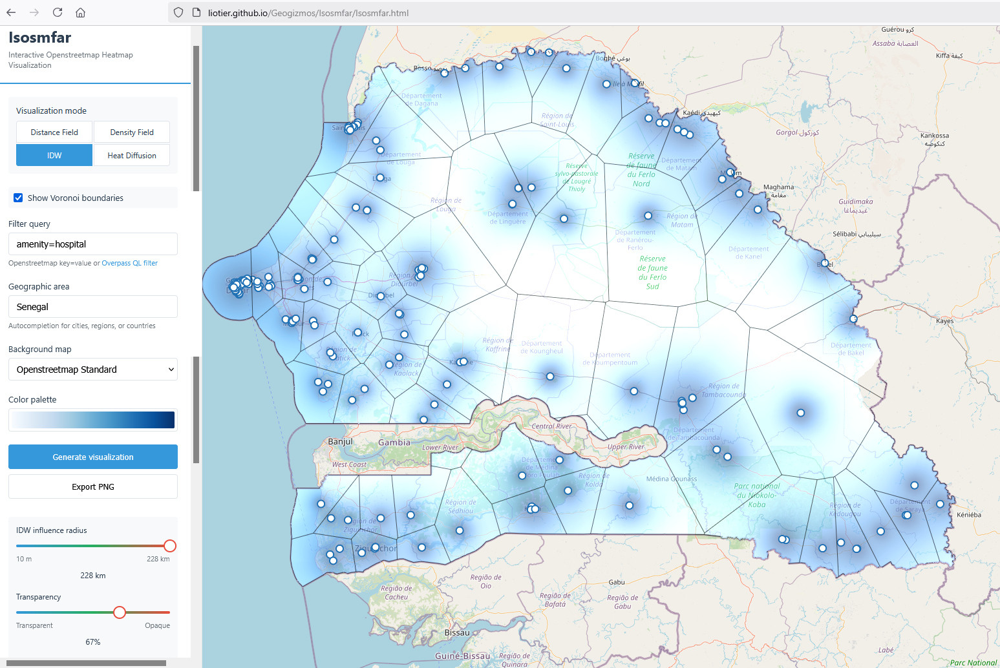

# Isosmfar

**Isosmfar** is an interactive web application for exploring **iso-distance fields** based on OpenStreetMap (OSM) data. It lets you visualize how far every location in a chosen area is from features that match a query (e.g. schools, hospitals, bus stops, restaurants, etc.).

The app is fully self-contained in a single file - with the notable exception of being entirely dependent and built on the whole Openstreetmap universe... Isosmfar is nothing without Openstreetmap data and services.

I love Openstreetmap !

# 👉 [Try it now – Isosmfar online](https://liotier.github.io/Geogizmos/Isosmfar/)

## ✨ Key Features

- **No setup required**
  This is the full product, freely available online.
  **No installation, no sign-up, no limitations.**
  Works directly in your browser.

- **Progressive Web App**
  Install as a standalone app on any device.
  **Works offline** after first load – cached for instant access anywhere.

- **Share your visualizations**
  Every parameter encoded in the URL – copy and share exact visualizations with colleagues.
  All settings (area, query, colors, mode) preserved in shareable links.

- **Flexible queries**
  Define features of interest with simple `key=value` filters or full [Overpass QL](https://wiki.openstreetmap.org/wiki/Overpass_API/Overpass_QL) queries.

- **Real-time distance field visualization**
  See a continuous heatmap of distances to the nearest matching features.
  Smooth WebGL rendering with instant parameter updates at 60fps.

- **Smart area selection**
  Choose any area by name using [Nominatim](https://nominatim.org/) autocompletion.

- **Advanced customization**
  - Exponential-scale gradient radius control for precise tuning at any scale (10m to 100km+)
  - Six color palettes with 17-step interpolation
  - Transparency control with edge-fading for natural density visualization
  - Multiple basemap layers (Standard, Humanitarian, Carto Light)
  - Preferences automatically saved and restored

- **High-performance rendering**
  Powered by **WebGL 2.0/1.0 shaders** for buttery-smooth 60fps interaction even with thousands of points.
  Automatic performance optimization based on browser capabilities.

- **Intelligent caching**
  Query results cached locally for 7 days – instant repeat visualizations without API delays.
  Automatic retry with exponential backoff for reliable API access.

- **Export your results**
  Save pixel-perfect visualizations as PNG images for sharing, reporting, or further analysis.

## 🛠️ Technical Excellence

Isosmfar showcases several sophisticated web development techniques:

### WebGL Custom Layer Implementation
- **WebGL 2.0/1.0 adaptive rendering** with automatic capability detection
- **GPU-accelerated distance computation** using custom vertex and fragment shaders
- **Texture-based data storage** allowing efficient processing of up to 5,000 features
- Features are packed into floating-point textures (RGBA32F in WebGL 2.0) for parallel GPU processing
- Color palettes stored as 1D textures for smooth gradient interpolation
- Graceful fallback to WebGL 1.0 with extensions when needed

### Smart UI/UX Design
- **Exponential-scale sliders** providing intuitive control across 4 orders of magnitude (10m to 100km)
- **Adaptive distance defaults** automatically calculated based on area size and feature density
- **17-step color interpolation** creating smooth gradients from 9-color base palettes
- **Edge-fading transparency** multiplying alpha by distance for natural density visualization
- **URL state persistence** – all visualization parameters encoded in URL for easy sharing
- **Local storage preferences** – remembers your palette, basemap, and mode choices

### Performance Optimizations
- **Throttled rendering** at 60fps for smooth slider interactions
- **Debounced operations** preventing excessive recomputation during user input
- **Haversine distance calculations** performed directly in shader code
- **Texture sampling** for both feature positions and color palettes
- **Dynamic level-of-detail** – processes only visible area at current zoom
- **Deduplication** of overlapping features to prevent redundant calculations
- **Parallel processing** – fragment shader computes distances to all features simultaneously

### Advanced Caching & Resilience
- **IndexedDB caching layer** storing Overpass API results for 7 days
- **Automatic retry with exponential backoff** (1s, 2s, 4s delays) for failed API calls
- **Service Worker implementation** for offline functionality and instant loading
- **Smart cache invalidation** based on configurable expiration policies
- Reduced API load while maintaining fresh data

### Robust Architecture
- **ES6 modular design** with clean separation of concerns
- **Centralized configuration** with named constants (no magic numbers)
- **Promise-based async operations** for smooth API interactions
- **Comprehensive error handling** with user-friendly error messages
- **Debounced search** preventing excessive Nominatim API calls
- **Canvas preservation** for reliable PNG exports with `preserveDrawingBuffer`
- **Progressive Web App** architecture with manifest and service worker

## 🔧 Technology Stack

- **JavaScript (ES6+)** – modern language features
- **WebGL 2.0/1.0** – hardware-accelerated graphics rendering with adaptive capability detection
- **[MapLibre GL JS](https://maplibre.org/)** – high-performance map display
- **[Turf.js](https://turfjs.org/)** – spatial analysis and area calculations
- **[D3-Delaunay](https://d3js.org/d3-delaunay/voronoi)** – Voronoi diagram generation
- **[Overpass API](https://overpass-api.de/)** – OSM feature queries
- **[Nominatim](https://nominatim.org/)** – geocoding and area search
- **Custom GLSL Shaders** – GPU-based distance field computation
- **IndexedDB** – local caching of API results
- **Service Workers** – offline functionality and resource caching
- **Local Storage** – user preference persistence
- **URL State Management** – shareable visualization links

## 📖 How It Works

1. **Select an area**
   Nominatim provides intelligent autocompletion with boundary polygon retrieval.
   Search is debounced to prevent excessive API calls.

2. **Query OSM features**
   Checks IndexedDB cache first – if found, loads instantly.
   Otherwise, Overpass API returns features matching your criteria within the selected boundary.
   Automatic retry with exponential backoff ensures reliable results.
   Results cached for 7 days for instant future access.

3. **GPU-accelerated processing**
   Features are packed into floating-point textures and sent to the GPU.
   Custom WebGL 2.0/1.0 shaders compute continuous distance fields in real-time.
   Automatic selection of optimal texture format based on browser capabilities.

4. **Dynamic visualization**
   Distance field rendered as smooth gradient overlay with throttled 60fps updates.
   All parameters (radius, transparency, palette) update instantly without recomputation.
   State automatically saved to URL and localStorage for sharing and persistence.

5. **Export & sharing**
   MapLibre's canvas captured with proper WebGL context preservation for pixel-perfect PNG exports.
   Copy URL to share exact visualization with all parameters preserved.
   Works offline after first load thanks to service worker caching.

## 🎨 Advanced Features

- **Smart distance scaling**: Exponential scale provides fine control at both local (meters) and regional (kilometers) scales
- **Adaptive defaults**: Initial gradient radius automatically calculated as ~12% of the area's characteristic dimension
- **Palette hot-swapping**: Change color schemes in real-time without recomputing the distance field
- **URL state sharing**: All visualization parameters encoded in URL hash for instant sharing with colleagues
- **Persistent preferences**: Color palette, basemap, and mode choices remembered across sessions
- **Intelligent caching**: Query results cached in IndexedDB for 7 days – repeat queries load instantly
- **Offline capability**: Full functionality after first load thanks to Progressive Web App architecture
- **Resilient API access**: Automatic retry with exponential backoff handles temporary network issues
- **Performance throttling**: Slider interactions throttled at 60fps for smooth, responsive UI

## 📦 Deployment

Since Isosmfar is a static single-page application:

- Run locally by opening `Isosmfar.html` in any modern browser
- Host on GitHub Pages, Netlify, or any static hosting service
- Embed in existing applications as an iframe
- Fork and customize for domain-specific use cases
- **Install as PWA** – add to home screen on mobile/desktop for offline access

**No server infrastructure required** – just static file hosting and access to public OpenStreetMap services.

### Offline Usage

After the first load, Isosmfar works completely offline thanks to:
- Service worker caching all static assets
- IndexedDB storing recent query results
- LocalStorage preserving user preferences

Perfect for field work or areas with unreliable connectivity!

## 📜 License

This project is distributed under the [Unlicense](https://unlicense.org), placing it in the public domain.  
You are free to use, modify, and distribute this software for any purpose.

## 👤 Author

Created by Jean-Marc Liotier  
[View on GitHub](https://github.com/liotier/Geogizmos/tree/main/Isosmfar)
